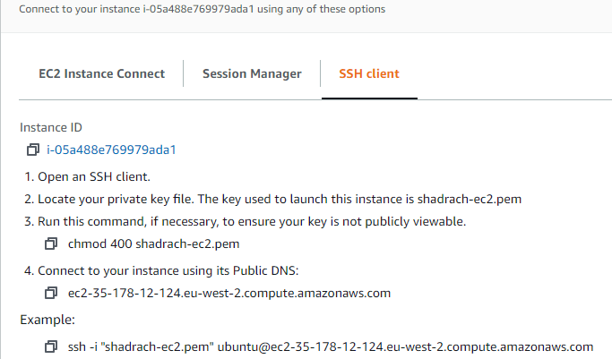
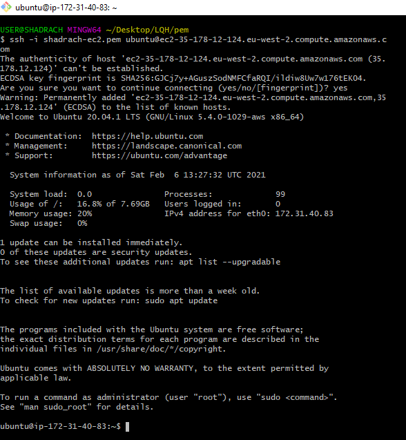
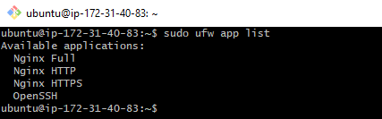
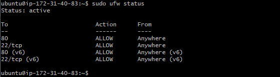
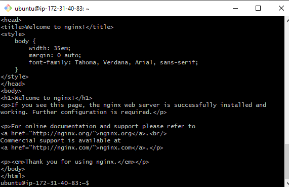
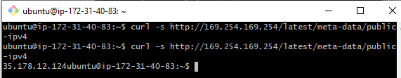
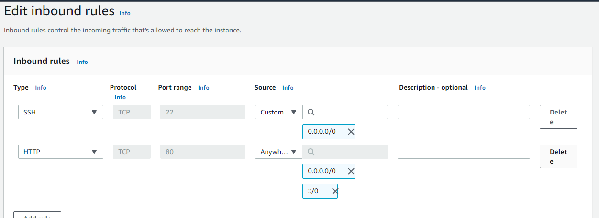
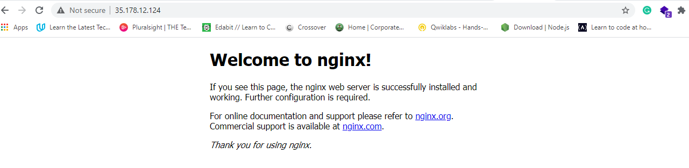

# **LEMP STACK IMPLEMENTATION**
* In order to complete this project you will need an AWS account and a Vitual Server with Ubuntu Server OS.
* To learn how to create an AWS free tier account and an EC2 Instance of t2.micro family with Ubuntu Server 20.04 LTS(HVM), follow this link: [Create an EC2 Instance in AWS](https://github.com/Shadrach247/LAMP-STACK-IMPLEMENTATION-IN-AWS)
* This time, instead of connecting via PuTTY, I will connect to my EC2 Instance with an already downloaded and installed Git Bash Command Line Interface (CLI).
* To connect, Launch Git Bash and run the following command:


```Bash
ssh -i shadrach-ec2.pem ubuntu@ec2-35-178-12-124.eu-west-2.compute.amazonaws.com
```
* _It will look like this:_


# **STEP 1 - Installing the Nginx Web Server**
* In order to display web pages to our site visitors we are going to employ Nginx, a high performance Web Server. We'll use the **apt** Package Manager to install this package.
* Since this is our first time using **apt** for this session, start of by updating your server's package index. Following that, you can use **apt** install to get Nginx installed:
```Bash
$ sudo apt update

$ sudo apt install nginx
```
* When prompted, enter **Y** to confirm that you want to install Nginx. Once the installation is finished, the Nginx Web Server will be active and running on your Ubuntu 20.04 Server.
* To verify that nginx was successfully installed and running as a service in Ubuntu, run:
```Bash
$ sudo systemctl status nginx
```
* If it is green and running, then you did everything correctly - you have just launch your first web Server in the Clouds!

* We need to configure our firewall settings to allow HTTP traffic. UFW has different application profiles that we can leverage for accomplishing that.
* To list all currently available UFW application profile, **run :**
```Bash
sudo ufw app list
```


_Available applications :_

* Nginx Full : This profile opens both port 80(normal, unencrypted web traffic) and port 443(TLS/SSL encrypted web traffic)
* Nginx HTTP : This profile opens only port 80(normal, unencrypted web traffic)
* Nginx HTTPS : This profile opens only port 443(TLS/SSL encrypted traffic)

It is recommended that you enable the most restrictive profile that will still allow the traffic you've configured. Since we haven't configured SSL for our Server yet, we will ony need to allow traffic on port 80.
* You can enable this by typing:
```Bash
$ sudo ufw allow 80

$ sudo ufw allow ssh

$ sudo ufw enable
```
_You may get a prompt like this:_
> command may disrupt existing ssh connection. proceed with operation (y/n)?

_Click on **y** on your keyboard and ENTER to proceed._

* You can verify the change by typing:
```Bash
$ sudo ufw status
```
_You should see HTTP traffic allowed in the displayed output :_



First, lets try to access it locally in our Ubuntu shell, **run:**

```Bash
$ curl http://localhost:80
or
$ curl http://127.0.0.1:80
```

As an output, you can see some strangely formatted test, do not worry, we just made sure that our Nginx web service responds to _'curl'_ command with some payload.

Now it is time for to test how our Nginx Server can respond to requests from the internet.
* Another way to retrieve your Public IP address, other than to check it in AWS Web Console, is to use the following command.
```Bash
curl -s http://169.254.169.254/latest/meta-data/public-ipv4
```



* Open a web browser of your choice and try to access the following URL:
```Bash
http://<Public-IP-Address>:80
```
* See the Public IP I used:
```Bash
35.178.12.124:80
```
To make it work and accessible from the internet, I had to do a manual adjustment of the Security Group settings to allow inbound request from TCP/80/AnyWhere.



* Voila! Connection was successful after saving my new Inbound rules and refreshing the page. 
 * _see my output :_


Infact, it is the same content that we previously got by _'curl'_ command, but represented in a nice HTML formatting by the web browser.

# **STEP 2 - Installing MySQL**
