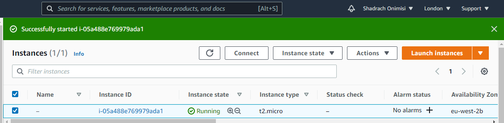

# **LEMP STACK IMPLEMENTATION**

What is **LEMP stack?**

**LEMP** is a variation of the ubiquitous LAMP stack used for developing and deploying web applications. Traditionally, LAMP consists of Linux, Apache, MySQL, and PHP. Due to its modular nature, the components can easily be swapped out. With LEMP, Apache is replaced with the lightweight yet powerful Nginx.

**_Linux_**

An open source Unix-like operating system provides the base for the stack components. Many distributions include package management systems that make installing the desired applications easy. However, these repository versions will generally not be the most current. Two of the most commonly used Linux distributions in LEMP stacks are Debian and Ubuntu.

**_Nginx :_**

Nginx is an open source reverse proxy server for HTTP, HTTPS, SMTP, POP3, and IMAP protocols. It also functions as a load balancer, HTTP cache, and web server (origin server). It has a strong focus on high concurrency, high performance and low memory usage. The HTML5 Boilerplate project has sample server configuration files to improve performance and security.

**_MySQL :_**

MySQL is the second most widely used open source relational database management system. A community-developed fork, MariaDB, is led by the original developers. It aims to be a drop-in replacement.

**_PHP_**

PHP is a server-side scripting language designed for web development. The scripting role can also be filled with Python or Perl. Servers such as Gunicorn or uWSGI can be used in conjunction with Nginx to serve these applications.


* In order to complete this project you will need an AWS account and a Vitual Server with Ubuntu Server OS.
* To learn how to create an AWS free tier account and an EC2 Instance of t2.micro family with Ubuntu Server 20.04 LTS(HVM), follow this link: [Create an EC2 Instance in AWS](https://github.com/Shadrach247/LAMP-STACK-IMPLEMENTATION-IN-AWS)
* This time, instead of connecting via PuTTY, I will connect to my EC2 Instance with an already downloaded and installed Git Bash Command Line Interface (CLI).
* To connect, Launch Git Bash and run the following command:


```Bash
ssh -i shadrach-ec2.pem ubuntu@ec2-35-178-12-124.eu-west-2.compute.amazonaws.com
```
* _It will look like this:_


This is how I got the complete and valid command that works with my already created Ubuntu 20.04 LTS(HVM) AWS Instance I connected to.
* First, I selected the Server I want to connect to:



* Then, Click on the **connect** button. The image below will be navigated to:


There you have it!

# **STEP 1 - Installing the Nginx Web Server**
* In order to display web pages to our site visitors we are going to employ Nginx, a high performance Web Server. We'll use the **apt** Package Manager to install this package.
* Since this is our first time using **apt** for this session, start of by updating your server's package index. Following that, you can use **apt** install to get Nginx installed:
```Bash
$ sudo apt update

$ sudo apt install nginx
```
* When prompted, enter **Y** to confirm that you want to install Nginx. Once the installation is finished, the Nginx Web Server will be active and running on your Ubuntu 20.04 Server.
* To verify that nginx was successfully installed and running as a service in Ubuntu, run:
```Bash
$ sudo systemctl status nginx
```
* If it is green and running, then you did everything correctly - you have just launch your first web Server in the Clouds!

* We need to configure our firewall settings to allow HTTP traffic. UFW has different application profiles that we can leverage for accomplishing that.
* To list all currently available UFW application profile, **run :**
```Bash
sudo ufw app list
```


_Available applications :_

* Nginx Full : This profile opens both port 80(normal, unencrypted web traffic) and port 443(TLS/SSL encrypted web traffic)
* Nginx HTTP : This profile opens only port 80(normal, unencrypted web traffic)
* Nginx HTTPS : This profile opens only port 443(TLS/SSL encrypted traffic)

It is recommended that you enable the most restrictive profile that will still allow the traffic you've configured. Since we haven't configured SSL for our Server yet, we will ony need to allow traffic on port 80.
* You can enable this by typing:
```Bash
$ sudo ufw allow 80

$ sudo ufw allow ssh

$ sudo ufw enable
```
_You may get a prompt like this:_
> command may disrupt existing ssh connection. proceed with operation (y/n)?

_Click on **y** on your keyboard and ENTER to proceed._

* You can verify the change by typing:
```Bash
$ sudo ufw status
```
_You should see HTTP traffic allowed in the displayed output :_


First, lets try to access it locally in our Ubuntu shell, **run:**

```Bash
$ curl http://localhost:80
or
$ curl http://127.0.0.1:80
```

As an output, you can see some strangely formatted test, do not worry, we just made sure that our Nginx web service responds to _'curl'_ command with some payload.

Now it is time for to test how our Nginx Server can respond to requests from the internet.
* Another way to retrieve your Public IP address, other than to check it in AWS Web Console, is to use the following command.
```Bash
curl -s http://169.254.169.254/latest/meta-data/public-ipv4
```


* Open a web browser of your choice and try to access the following URL:
```Bash
http://<Public-IP-Address>:80
```
* See the Public IP I used:
```Bash
35.178.12.124:80
```
To make it work and accessible from the internet, I had to do a manual adjustment of the Security Group settings to allow inbound request from TCP/80/AnyWhere.


* Voila! Connection was successful after saving my new Inbound rules and refreshing the page. 
 * _see my output :_


Infact, it is the same content that we previously got by _'curl'_ command, but represented in a nice HTML formatting by the web browser.

# **STEP 2 - Installing MySQL**
Now that you have a Web Server up and running you need to install a Database Management System(DBMS) to be able to store and manage data for your site in a relational database. MySQL is a popular relational database management system used within PHP environments, so we will use it in our project.
Again use **_apt_** to acquire and install this software :
```Bash
$ sudo apt install mysql-server
```
When prompted, confirm installation by typing **Y**, and then ENTER.

When the installation is finished, it's recommended that you run a security script that comes pre-installed with MySQL. This Script will remove some insecure default settings and lock down access to your database system.
Start the interactive script by running:
```Bash
$ sudo mysql_secure_installation
```
This will ask if you want to configure the VALIDATE PASSWORD PLUGIN. Answer **Y** for "yes" or anything else to continue without enabling.
If you answer "yes", you'll be asked to select a level of password validation. Keep in mind that if you enter **2** for the strongest level you will receive errors when attempting to set any password which does not contain numbers, upper and lowercase letters, and special charachers, or which is based on common dictionary words.

Regardless of whether you chose to set up the VALIDATE PASSWORD PLUGIN, your Server will next ask you to select and confirm a password for MySQL **root** user. This is not to be confused with the **system root**. The **database root** user is an administrative user with full privileges over the database system. Even though the default authentication method for the MySQL root user dispenses the use of a password, **even when one is set**, you should define a strong password here as an additional safety measure.

If you enabled password validation, you'll be shown the password strength for the root password you just entered and your Server will ask if you want to continue with that password. If you are happy with your current password, enter **Y** for "yes" at the prompt.

For the rest of the questions, press **Y** and hit ENTER key at the prompt. This will remove some anonymous users and the test database, disable remote root logins, and load these new rules so that MySQL immediately respect the changes you have made.

When you are finished, test if you're able to log into the MySQL console by typing:

```Bash
$ sudo mysql
```
This will connect to the MySQL Server as the administrative database user **root**, which is infered by the use of **_sudo_** when running this command.

You should see an output like this :

To exit the MySQL console, type :

Notice that you didn't need to provide a password to connect as the **root** user, even though you have defined one when running the mysql_secure_installation script. That is because the default authentication method for the administrative MySQL user is **unix_socket** instead of **password**. Even though this might look like a security concern at first, it makes the database server more secure because the only users allowed to log is as the root MySQL user are the system users with _**sudo**_ privileges connecting from the console or through an application running with the same privileges. In practical terms, that means you won't be able to use the administrative database root user to connect from your PHP application. Setting a password for the root MySQL accounts works as a safeguard, in case the default authentication method is changed from **unix_socket** to **password**.

For increased security, it's best to have dedicated user accounts with less expansive privileges set up for every database, especially if you plan on having multiple databases hosted on your server

Your MySQL Server is now installed and secured. Next, we will install PHP, the final component in the **LEMP Stack**

# **STEP 3 - Installing PHP**
You have Nginx installed to serve your content and MySQL installed to store and manage your data. Now you can install PHP to process code and generate dynamic content for the Web Server.

While Apache embeds the PHP interpreter in each request, Nginx requires an external program to handle PHP processing and act as a bridge between the PHP interpreter itself and the Web Server. This allows for a better performance in most PHP-based websites, but it requires additional configuration. You'll need to install **php-fpm**, which stands for "PHP fastCGI Process Manager", and tell Nginx to pass PHP requests to this software for processing. Additionally you'll need **php-mysql**, a PHP module that allows PHP to communicate with MySQL-based databases. Core PHP packages will automatically be installed as dependenes.

To install these 2 packages at once, **run :**
```Bash
$ sudo apt install php-fpm php-mysql
```
When prompted, type **Y** and press ENTER to confirm installation. You now have your PHP components installed. Next, you will configure Nginx to use them.

# **STEP 4 - Configuring Nginx to use PHP Processor**
When using the Nginx web server, we can create server blocks (similar to virtual hosts in Apache) to encapsulate configuration details and host more than one domain on a single server. We will use projectLEMP as an example domain name.

On Ubuntu 20.04, Nginx has one server block enabled by default and is configured to serve documents out of a directory at **_/var/www/html_**. While this works well for a single site, it can become difficult to manage if you are hosting multiple sites. Instead of modifying **_/var/www/html_**, we’ll create a directory structure within **_/var/www_** for the your_domain website, leaving **_/var/www/html_** in place as the default directory to be served if a client request does not match any other sites.

* Create the root web directory for your_domain as follows:

```Bash
$ sudo mkdir /var/www/projectLEMP
```
* Next, assign ownership of the directory with the $USER environment variable, which will reference your current system user:

```Bash
$ sudo chown -R ubuntu:ubuntu /var/www/projectLEMP
```
* Then, open a new configuration file in Nginx’s **sites-available** directory using your preferred command-line editor. Here, we’ll use **_nano_**:

```Bash
$ sudo nano /etc/nginx/sites-available/projecLEMP
```

* This will create a new blank file. Paste in the following bare-bones configuration:

```Bash
#/etc/nginx/sites-available/projectLEMP

server {
    listen 80;
    server_name projectLEMP www.projectLEMP;
    root /var/www/projectLEMP;

    index index.html index.htm index.php;

    location / {
        try_files $uri $uri/ =404;
    }

    location ~ \.php$ {
        include snippets/fastcgi-php.conf;
        fastcgi_pass unix:/var/run/php/php7.4-fpm.sock;
     }

    location ~ /\.ht {
        deny all;
    }

}
```
Here’s what each of these directives and location blocks do:

**_listen_** — Defines what port Nginx will listen on. In this case, it will listen on port **_80_**, the default port for HTTP.
**_root_** — Defines the document root where the files served by this website are stored.
**_index_** — Defines in which order Nginx will prioritize index files for this website. It is a common practice to list **_index.html_** files with a higher precedence than **_index.php_** files to allow for quickly setting up a maintenance landing page in PHP applications. You can adjust these settings to better suit your application needs.
**_server_name_** — Defines which domain names and/or IP addresses this server block should respond for. **Point this directive to your server’s domain name or public IP address.**
**_location /_** — The first location block includes a **_try_files_** directive, which checks for the existence of files or directories matching a URI request. If Nginx cannot find the appropriate resource, it will return a 404 error.
**_location ~ \.php$_** — This location block handles the actual PHP processing by pointing Nginx to the fastcgi-php.conf configuration file and the **_php7.4-fpm.sock file_**, which declares what socket is associated with **_php-fpm_**.
**_location ~ /\.ht_** — The last location block deals with **_.htaccess_** files, which Nginx does not process. By adding the deny all directive, if any **_.htaccess_** files happen to find their way into the document root ,they will not be served to visitors.

When you’re done editing, save and close the file. If you’re using **_nano_**, you can do so by typing **_CTRL+X_** and then **_y_** and **_ENTER_** to confirm.

Activate your configuration by linking to the config file from Nginx’s **_sites-enabled_** directory:

```Bash
$ sudo ln -s /etc//nginx/sites-available/projectLEMP /etc/nginx/sites-enabled/
```

This will tell Nginx to use the configuration next time it is reloaded. You can test your configuration for syntax errors by typing:

```Bash
$ sudo nginx -t
```

* You shall see following message:


If any errors are reported, go back to your configuration file to review its contents before continuing.

We also need to disable default Nginx host that is currently configured to listen on port 80, for this run:

```Bash
$ sudo unlink /etc/nginx/sites-enabled/default
```

When you are ready, reload Nginx to apply the changes:

```Bash
$ sudo systemctl reload nginx
```

Your new website is now active, but the web root **_/var/www/projectLEMP_** is still empty. Create an **_index.html_** file in that location so that we can test that your new server block works as expected:

Now go to your browser and try to open your website URL using IP address:

```Bash
http://<Public-DNS-Name>:80
```

You can also access your website in your browser by public DNS name, not only by IP - try it out, the result must be the same (port is optional)

```Bash
http://<Public-DNS-Name>:80
```

You can leave this file in place as a temporary landing page for your application until you set up an **_index.php_** file to replace it. Once you do that, remember to remove or rename the **_index.html_** file from your document root, as it would take precedence over an **_index.php_** file by default.

Your LEMP stack is now fully configured. In the next step, we’ll create a PHP script to test that Nginx is in fact able to handle **_.php_** files within your newly configured website.

# **STEP 5 - Testing PHP with Nginx**
At this point, your LEMP stack is completely installed and fully operational.

You can test it to validate that Nginx can correctly hand **_.php_** files off to your PHP processor.

You can do this by creating a test PHP file in your document root. Open a new file called **_info.php_** within your document root in your text editor:

```Bash
$ nano /var/www/projectLEMP/info.php
```

Type or paste the following lines into the new file. This is valid PHP code that will return information about your server:

```Bash
<?php
phpinfo();
```
You can now access this page in your web browser by visiting the domain name or public IP address you’ve set up in your Nginx configuration file, followed by **_/info.php:_**

```Bash
http://`server_domain_or_IP`/info.php
```

You will see a web page containing detailed information about your server:


After checking the relevant information about your PHP server through that page, it’s best to remove the file you created as it contains sensitive information about your PHP environment and your Ubuntu server. You can use rm to remove that file:

```Bash
$ sudo rm /var/www/your_domain/info.php
```
You can always regenerate this file if you need it later.

# **STEP 6 - Retrieving data from MySQL database with PHP**
In this step you will create a test database (DB) with simple “To do list” and configure access to it, so the Nginx website would be able to query data from the DB and display it.

At the time of this writing, the native MySQL PHP library **_mysqlnd_** doesn’t support **_caching_sha2_authentication_**, the default authentication method for MySQL 8. We’ll need to create a new user with the **_mysql_native_password_** authentication method in order to be able to connect to the MySQL database from PHP.

We will create a database named **_example_database_** and a user named **_example_user_**, but you can replace these names with different values.

First, connect to the MySQL console using the **_root_** account:

```Bash
$ sudo mysql
```

To create a new database, run the following command from your MySQL console:

```Bash
mysql> CREATE DATABASE `example_database`;
```

Now you can create a new user and grant him full privileges on the database you have just created.

The following command creates a new user named **_example_user_**, using mysql_native_password as default authentication method. We’re defining this user’s password as **_password_**, but you should replace this value with a secure password of your own choosing.

```Bash
mysql>  CREATE USER 'example_user'@'%' IDENTIFIED WITH mysql_native_password BY 'password';
```

Now we need to give this user permission over the **_example_database_** database:

```Bash
mysql> GRANT ALL ON example_database.* TO 'example_user'@'%';
```

This will give the example_user user full privileges over the example_database database, while preventing this user from creating or modifying other databases on your server.

Now exit the MySQL shell with:
```Bash
mysql> exit
```
You can test if the new user has the proper permissions by logging in to the MySQL console again, this time using the custom user credentials:

```Bash
$ mysql -u example_user -p
```
Notice the **_-p_** flag in this command, which will prompt you for the password used when creating the **_example_user_** user. After logging in to the MySQL console, confirm that you have access to the **_example_database_** database:

```Bash
mysql> SHOW DATABASES;
```

This will give you the following output:


Next, we’ll create a test table named todo_list. From the MySQL console, run the following statement:

```Bash
CREATE TABLE example_database.todo_list (
mysql>     item_id INT AUTO_INCREMENT,
mysql>     content VARCHAR(255),
mysql>     PRIMARY KEY(item_id)
mysql> );
```

Insert a few rows of content in the test table. You might want to repeat the next command a few times, using different VALUES:

```Bash
mysql> INSERT INTO example_database.todo_list (content) VALUES ("My first important item");
```

To confirm that the data was successfully saved to your table, run:

```Bash
mysql>  SELECT * FROM example_database.todo_list;
```

You’ll see the following output:


After confirming that you have valid data in your test table, you can exit the MySQL console:

```Bash
mysql> exit
```

Now you can create a PHP script that will connect to MySQL and query for your content. Create a new PHP file in your custom web root directory using your preferred editor. We’ll use vi for that:

```Bash
$ nano /var/www/projectLEMP/todo_list.php
```

The following PHP script connects to the MySQL database and queries for the content of the **_todo_list_** table, displays the results in a list. If there is a problem with the database connection, it will throw an exception.

Copy this content into your **_todo_list.php_** script:

```Bash
<?php
$user = "example_user";
$password = "password";
$database = "example_database";
$table = "todo_list";

try {
  $db = new PDO("mysql:host=localhost;dbname=$database", $user, $password);
  echo "<h2>TODO</h2><ol>";
  foreach($db->query("SELECT content FROM $table") as $row) {
    echo "<li>" . $row['content'] . "</li>";
  }
  echo "</ol>";
} catch (PDOException $e) {
    print "Error!: " . $e->getMessage() . "<br/>";
    die();
}
```

Save and close the file when you are done editing.

You can now access this page in your web browser by visiting the domain name or public IP address configured for your website, followed by **_/todo_list.php:_**

```Bash
http://<Public_domain_or_IP>/todo_list.php
```

You should see a page like this, showing the content you’ve inserted in your test table:


That means your PHP environment is ready to connect and interact with your MySQL server.

**_Congratulations!_**

In this guide, we have built a flexible foundation for serving PHP websites and applications to your visitors, using Nginx as web server and MySQL as database management system.